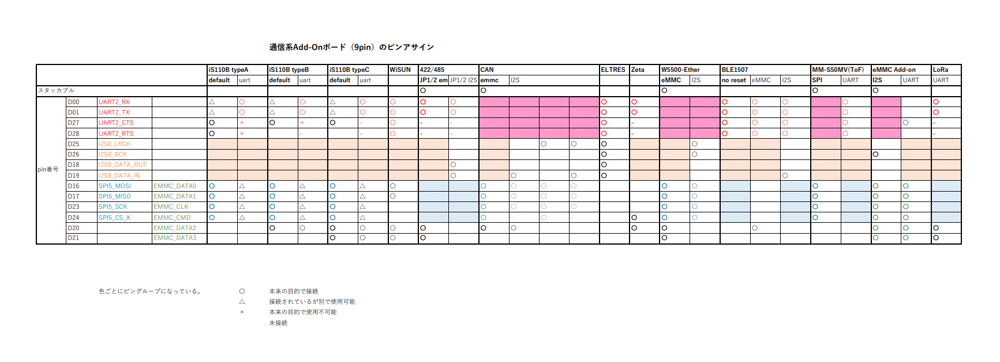

# Spresense-Playground
Let's Play Spresense!

Spresenseを使った遊び場です。 + 
SPRESENSEで使える各種ライブラリ、サンプルコードを開発・提供していきます。

本線リポジトリに取り込まれたものは、削除していきます。

--------------------
## 現在の各ボードパッケージのバージョン

Spresense HighSpeedADC : v2.0.2 (Base v2.0.1) <br>
Spresense Instrument   : v2.6.1 (Base v2.6.0) <br>

--------------------
## Add-Onボードピンアサイメント

 
   

   

   

-------------------- 
## What's new.

2024/10/5

・SpresenseからLINEに通知を送るサンプルの追加

  https://github.com/TomonobuHayakawa/Spresense-Playground/tree/master/sketches/withLINE/viaLTE/notify_sample


2024/8/16

・LoRaライブラリを更新。（トランスペアレントモード、WRO送信モードのサンプル追加など）


2024/7/4

・Add-on ボードPin情報の更新（GNSS/USB Host）

・Spresenseで取得したステレオ音声データを、WiFi UDP経由でProcessingにリアルタイム表示をさせるサンプルの追加。
  https://github.com/TomonobuHayakawa/Spresense-Playground/tree/master/IntegrationWithProcessing/FrequencyCharacteristic/viaUDP_Multi


2024/1/31

・Leafonyプラットフォーム上でのサンプルの追加

  https://github.com/TomonobuHayakawa/Spresense-Playground/tree/master/withLeafony

・PIN情報の更新

2023/11/17

・サウンドエフェクター向けのサンプルを追加しました。

  https://github.com/TomonobuHayakawa/Spresense-Playground/tree/master/sketches/SoundEffector

2023/11/9

・UDP経由で、Processingを使ってFFTデータを保存する機能を追加。
  https://github.com/TomonobuHayakawa/Spresense-Playground/tree/master/IntegrationWithProcessing/FrequencyCharacteristic/viaUDP

2023/11/7

・Processinを使ってカメラのリアルタイム表示を行うサンプルを追加しました。
  https://github.com/TomonobuHayakawa/Spresense-Playground/tree/master/IntegrationWithProcessing/LiveCamera

2023/8/31

・WiFiのUDP経由でProcessinを使って周波数特性と生波形を観測するサンプルを追加しました。
  https://github.com/TomonobuHayakawa/Spresense-Playground/tree/master/IntegrationWithProcessing/FrequencyCharacteristic


2023/8/8

・学生向けのワークショップ向けのサンプル（BLEサンプルなど）追加
```
    Spresense-Playground
        ｜
        ├ ForHandsOn
```

・Zeta Add-on 向けライブラリの追加
```
    Spresense-Playground
        ｜
        ├ libraries
            ｜
            ├ TZM902Dx
```

・LoRa Add-on 向けライブラリの追加
```
    Spresense-Playground
        ｜
        ├ libraries
            ｜
            ├ spresense_e220900t22s_jp_lib
```

2023/8/30

・Processingとの連携用のサンプルを追加（WiFi UDP経由）及び、ディレクトリ構成の変更
  https://github.com/TomonobuHayakawa/Spresense-Playground/tree/master/IntegrationWithProcessing/SimpleSend

2023/8/29

・Processinを使って周波数特性を観測するサンプルに、生波形を見る機能を追加しました。
  https://github.com/TomonobuHayakawa/Spresense-Playground/tree/master/IntegrationWithProcessing/FrequencyCharacteristic

2023/5/30

・SpreSynth に関する情報を追加しました。

2023/8/8

・学生向けハンズオン用のサンプルコードを追加しました。(BLE、WiSUN、LoRa、など)
  https://github.com/TomonobuHayakawa/Spresense-Playground/tree/master/ForHandsOn

2023/3/17

・MIDIのライブラリを別リポジトリに移動。サンプルも追加。

https://github.com/TomonobuHayakawa/arduino_midi_library

2023/3/15

・各 3rdParty Add-Onボードのピンアサイメントを表にしました。</BR>
   

2023/2/25

・UDPなどのWiFi経由のためProcessingとの同期方法を変更

2023/2/24

・Processingとの連携用のサンプルでfloatを16bitにして送るサンプルに修正。
  ※現在、データサイズが大きいため、たまに同期が外れます。

2023/2/22

・Processingとの連携用のサンプルを追加（USBSerial経由）

  - 集音した音声データの周波数特性をProcrssingに表示するサンプル<br>
  https://github.com/TomonobuHayakawa/Spresense-Playground/tree/master/IntegrationWithProcessing/FrequencyCharacteristic
  ※現在、8bitの整数値のみ送っているが、16ビットの小数第2位まで送るように変更予定。


2023/2/19

・音響診断用サンプルのバグを修正しました。<br>
  https://github.com/TomonobuHayakawa/Spresense-Playground/tree/master/edge_ai/sound_analysis/sketches/FrequencyCharacteristicViewer

  - SDカードへの書き込みバッファの間違い
  - WiFi初期化中にキャプチャされたデータを処理できなかった問題の修正

・Processingとの連携用のサンプルを追加（USBSerial経由）

  - 単純なデータプリントサンプル<br>
  https://github.com/TomonobuHayakawa/Spresense-Playground/tree/master/IntegrationWithProcessing/SimpleSend

※こちらは、baggio63446333 さんの

  https://github.com/baggio63446333/SpresenseCameraApps/tree/main/UsbLiveStreaming

をベースに作成しています。


2023/1/25

・キーワード検出用のサンプルを更新しました。

key_word_detector を削除。KeywordDetectorを追加。

KeywordDetectorには、以前からある Worker を使用するサンプルと、<br>
https://github.com/TomonobuHayakawa/Spresense-Playground/tree/master/sketches/KeywordDetector/KeywordDetector_w_worker

ArduinoのSubCoreを使うサンプルを用意しました。<br>
https://github.com/TomonobuHayakawa/Spresense-Playground/tree/master/sketches/KeywordDetector/KeywordDetector_wo_worker

※時間ができたら、NNCを使ったキーワード検出ライブラリを作成する予定です。


・音響診断用サンプルで、FFTの波形を見ながら波形データを収集するサンプルを追加しました。
https://github.com/TomonobuHayakawa/Spresense-Playground/tree/master/edge_ai/sound_analysis/sketches/FrequencyCharacteristicViewer

※ただし、波形表示はサンプルレベル。

また、リクエストにより、波形表示の代わりにWiFiからUDPで送るサンプルに差し替えられるように追加しました。

※このサンプルを使用する場合は、GS2200のライブラリを最新にしてください。
https://github.com/TomonobuHayakawa/GS2200-WiFi

・各サンプルのために必要なライブラリのポインタを追加


2022/12/1

・楽器用パッケージ（Spresense Instrument   : v2.6.1 (Base v2.6.0) に楽器のスケッチを対応しました。

https://github.com/TomonobuHayakawa/spresense-arduino-compatible/releases/tag/v2.6.1


2022/11/28

・SubCoreをつかってセンシングするためのサンプルを追加しました。

- SubCoreSensing <br>
    - DmyData : 実際にはセンシングを行わずダミーデータをMainに送るサンプル。 <br>
    - Usb : Usb Host Addonを使ったセンサーを想定したサンプル。 <br>

※USB Host Addon


そのためのコード
https://github.com/TomonobuHayakawa/USB_Host_Shield_2.0

2022/07/19

・シンプルなMQTTのスケッチのセキュア版を追加しました。 <br>

- MQTT <br>
    - viaLTE <br>
        - secure_pub : 非認証、暗号でpublishするサンプル <br>
        - secure_sub : 非認証、暗号でsubscribeするサンプル <br>

2021/11/19

・MQTT使って、相互のSpresense のシリアルを入力したら、もう一方のSpresenseのLEDを点灯させるデモを追加。

- MQTT <br>
    - viaLTE <br>
        - M2M
          - m2m_client0
          - m2m_client1

2021/11/12

・シンプルなMQTTのスケッチを追加しました。 <br>

- MQTT <br>
    - viaLTE <br>
        - simple_pub : 非認証、非暗号でpublishするサンプル <br>
        - simple_sub : 非認証、非暗号でsubscribeするサンプル <br>

2021/06/11

・Instrumentのパッケージを2.2.1に更新しました。 <br>
 <br>

・M11Sのパッケージはサポート外にしました。 <br>
 <br>

・キーワード検出（音声認識）の結果を LCD (ILI9340) に表示するデモアプリを入れました。 <br>

```
sketchies : Arduinoスケッチを置く場所。
  ｜
  ├ keyword_detector_demo
```


2021/03/19

・YuruSynthの更新 <br>
   - キーボード（チョコボード）の対応 <br>
   - 和音対応とそれに伴うDSPの作成 <br>
   - その他細かい修正 <br>

それに伴い、以下を追加。 <br>
・チョコボードの動作サンプル <br>
・メトロノームをチョコボードから制御できるように対応 <br>


2021/01/14

・AudioOscillator (旧Oscillator) の更新<br>
    - 本線に向けて名前の変更。（Oscillator -> AudioOscillator）。<br>
    - LFOの追加。<br>


12/25

・CO2センシングのUpdate <br>
    - AmbientへのUpdateサンプルの更新。（エラー処理追加（電源断リブート）、状態管理をクラス化、I2Cの調整機能追加）<br>
    - IIJのMachinistへのUpdateサンプルを追加。 https://machinist.iij.jp/ <br>

    ※Ambient_SpresenseLTEMのライブラリを更新しました。なので、自分のところのforkを使ってください。
    https://github.com/TomonobuHayakawa/Ambient_SpresenseLTEM


11/27

・加重センサを使った重さ計測のサンプル追加<br>

11/23

・CO2センシング+AWS/Azure/Watson via Sigfox
    - Sigfoxは別途KCCS側の設定が必要です。 <br>
    - ライブラリは、こちらになります。: https://github.com/SMK-RD/WF931-Sigfox-module <br>

11/20

・CO2センシング+Ambient via GS2200のバグ修正とUpdate

●補足；このサンプルは、以下のライブラリが必要です。 <br>

 - CO2センサ： https://github.com/sparkfun/SparkFun_SCD30_Arduino_Library のシリアルの速度を115200に変更。 <br>
 ⇒ こっちつかってもらってもよいです。 https://github.com/TomonobuHayakawa/SCD30 <br>
 - WiFiとAmbientを使うとき：https://github.com/jittermaster/GS2200-WiFi <br>
 - OLEDを使うとき：https://github.com/olikraus/U8g2_Arduino <br>

※https://github.com/olikraus/U8g2_Arduino のライブラリのbuildが非常に遅いので要注意。 <br>


11/17

・サンプルスケッチ、CO2センシング+Ambient via LTE/GS2200追加

6/5

・YuruSynthに向けて準備。<BR>
   - メトロノームのサンプルを作成<BR>
   - YuruSynthのベースコード作成<BR>

4/28

・CO-Spresense向けのサンプルの更新。
   - TerminalからARMを制御するサンプル作成<BR>
   - 音声によるARMの制御をするサンプル作成<BR>

4/23

・オシレータライブラリの更新。<BR>
   - 波形タイプの動的変更<BR>
   - monoチャンネルのバグ修正<BR>

4/10

・SignalProcessingを本線に入れたのに合わせて、こちらも更新。<BR>
※次のリリース（v2.00）に入ります。

4/2

・CO-Spresense向けのサンプルを追加。

3/27

・オシレータのバグを修正。

・楽器向けボード(Spresense Instrument)の更新 (1.5.3) を行いました。 <br>
    - 本線のv1.5.1を取り込みました。 <br>
    - マイク入力を加工して出力するサンプルを追加しました。 <br>
    - MP3音声を再生しながら、マイク入力を加工して出力するサンプルを追加しました。 <br>
      - single_core : MainCoreのみ使用。Arduinoで加工可能。 <br>

※今回更新のスケッチは、メモリレイアウトなどの関係から、通常のSpresenseのボードでは動作しません。 <BR>
  *Spresense Instrument* のボードを使用してください。（使用方法は下記参照）

```
Spresense-Playground
 ｜
 ├ sketchies : Arduinoスケッチを置く場所。
     ｜
     ├ AudioPlayers
     ｜   ｜
     ｜   ├ player_with_effect_mic
     ｜
     ├ SoundEffector
         ｜
         ├ single_core

```

α版のinstallは、

Arduinoのファイル / 環境設定 の中の <br>
追加ボードマネージャのURLに、 <br>
https://github.com/TomonobuHayakawa/spresense-arduino-compatible/releases/download/common/package_spresense_instrument_index.json <br>
を追加してください。  

これを追加すると、ボードマネージャの中に、  

*Spresense Instrument*  

というボードが新たに選択できます。  

これを利用することで、上記機能を使用することができます。

注) 現時点で評価ができているものではありません。バグ等に関しての責任は負いかねます。
注) 現在提供のAPIは、暫定版です。正式版で変更される可能性があります。

*sketches/Instruments*

は、こちらのボードで作成されています。

3/18

・シンセサイザ機能むけオシレータ&エンベロープジェネレータのライブラリを作成しました。

3/16

・FFTライブラリの修正。

FFTライブラリのFFTのTap数、最大のチャンネル数が固定でしか運用できなかったため、
非常に使いづらかったです。<br>
ですが、同時に、CMSIS-DSPのライブラリがTAP数ごとにデータを持つため、
すべてのTAP数をリンクするとサイズが大きくなってしまう問題がありました。<br>
そのため、今回の実装で、templateで実装し回避しました。<br>
※苦肉の策…。<br>

不評であれば、再度考えます。<br>

--------------------
## ディレクトリ構成

```
Spresense-Playground
 |
 ├ examples : SDK上のサンプルコードを置く場所。
 |
 ├ libraries : Arduinoライブラリを置く場所。
 |
 ├ sketchies : Arduinoスケッチを置く場所。
 |
 ├ IntegrationWithProcessing : Spresense と Processingを連携させるサンプルを置く場所。
 |
 ├ SpreSynth : SpreSynth に関係するデータを置く場所。

```

---
## Arduino ライブラリリスト

### センサドライバ関連
* BSEC（BME680）

### 信号処理関連
* SignalProcessing(FFT/IIR)

### 音声処理関連
* PitchScaleAdjuster
* MIDI

### シンセサイザ機能関連
* Oscillator

---
## Arduino スケッチリスト
- AudioPlayers
    - audio_with_sensing
    - diy_player
    - diy_player_wo_sensing
    - NetRadio_w_sensing
    - player_with_effect_mic
    - player_with_mic

- AudioRendering
    - rendering_objif

- CO2Sensing
    - viaLTE
        - CO2_sensing_to_Ambient
        - CO2_sensing_to_Machinist
    - viaSigfox
        - CO2_sensing_via_Sigfox
    - viaWiFi
        - CO2_sensing_via_WiFi

- Co-Spresense
    - Pickup
    - TerminalControl
    - VoiceControl

- Instruments
    - Metronome
    - SmartCajon
    - SmartDrum
    - YuruHorn
    - YuruSynth
    
- keyword_detector_demo

- M11S
    - Jpeg_ESP8266_CamServer
    - Jpeg_shot_with_SD

- MQTT
    - viaLTE
        - simple_pub : 非認証、非暗号でpublishするサンプル
        - simple_sub : 非認証、非暗号でsubscribeするサンプル

- SoundEffector
    - multi_core
    - single_core

- USB_UART
- I2cScanner

- LowPowerSensing
    - bme680_ulp_plus_via_sigfox
    - bme680_uulp_plus_via_sigfox

- weight_sensing

