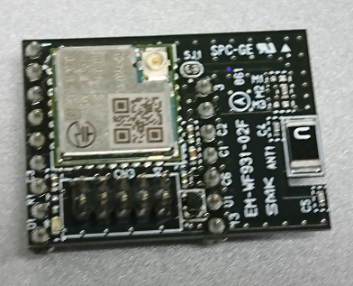
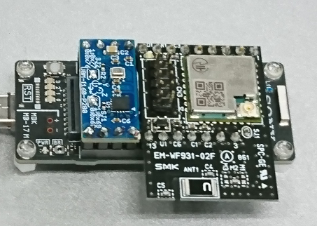

# Wf931 Module (SigFox) 向けサンプル

---------------

本サンプルは、SPRESENSE向け 

**Wf931 Module (SigFox) AddOnボード**

のサンプルです。

 

 

本ボードは、SPRSESENSEを利用した評価向けに、SMK様が作成しております。
現時点で一般販売はしておりません。
入手等のお問い合わせなどある場合は、こちらへご連絡をお願いします。

---------------

こちらのサンプルは、単純に、インクリメントデータをクラウドへ打ち上げる
ものになります。
ATコマンドの使用は、上記、SMK様にお問い合わせください。

